# UnrealPakViewer ##

Allows the user to view the contents of .pak files. Currently supports the following features:

* Tree view and list view to view files in the pak/ucas
* Open multiple pak/ucas files at the same time
* Search, filter, sort in list view
* View the specific content and composition information of the UAsset file
* Display the size of each folder, file, and file type as a percentage
* Multi-threaded decompression of Pak files
* Loading the AssetRegistry.bin resource registry

## Function ##

### Opening the .pak file ###

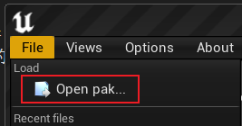

Directly drag the Pak file to the UnrealPakViewer window to open it, if the Pak file is encrypted, a password input box will pop up

After entering the Base64 format of the corresponding AES key, you can open the Pak file

### Viewing Pak file summary information ###

### Loading the resource registry ###

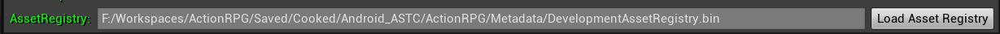

After cooking completes, it will dump resource registry information in *Saved/Cooked/[Platform]/[Project]/Metadata/DevelopmentAssetRegistry.bin*, which contains resource type, reference relationship and other information.

It can be loaded through Load Asset Registry to analyze the size ratio information of each resource type

### File tree view ###

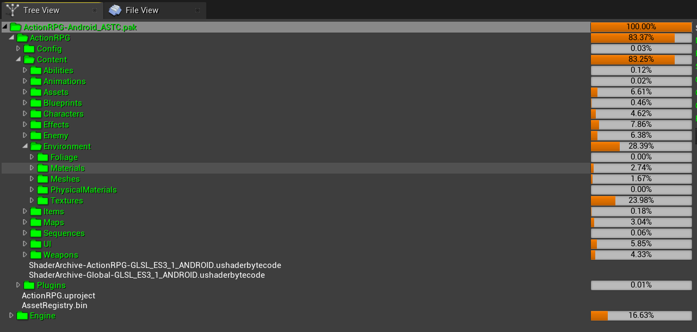

Lists the directories and files contained in the Pak in a tree structure, as well as the ratio of the directory size to the total size

#### After selecting a directory, you can view the details of the directory on the right ####

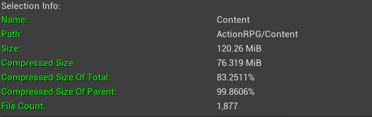

And the proportion information of each file type in the directory (you will need to load the AssetRegistry.bin registry)

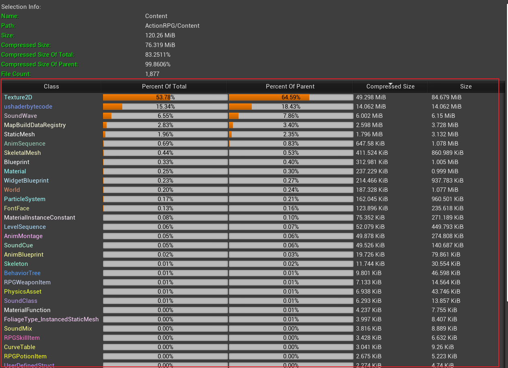

#### After selecting the file, you can view the file details on the right ####

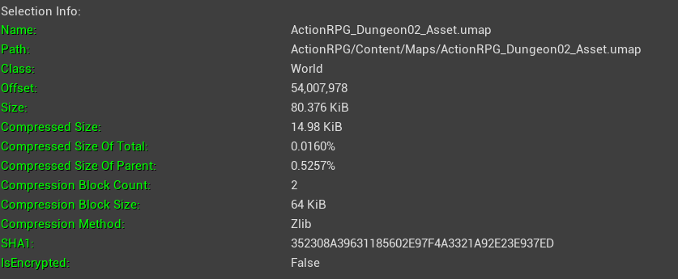

Compared to the contents, there is more information

If you select a .uasset or .umap file, you can also view the serialization information inside the file

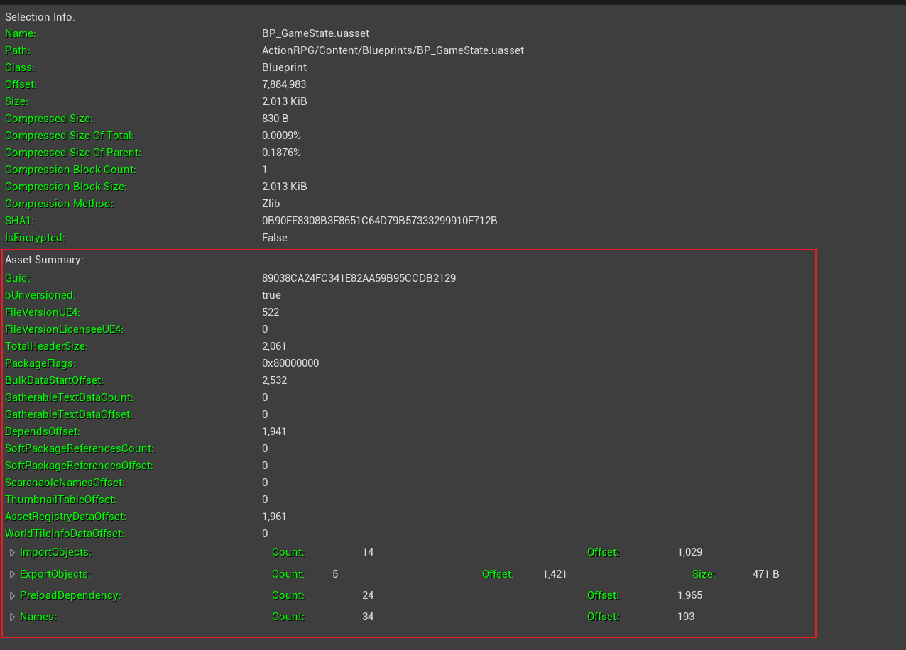

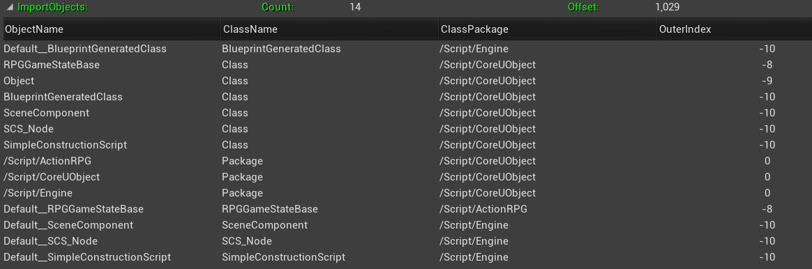

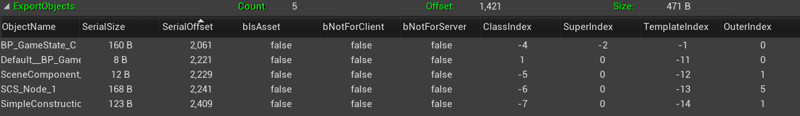

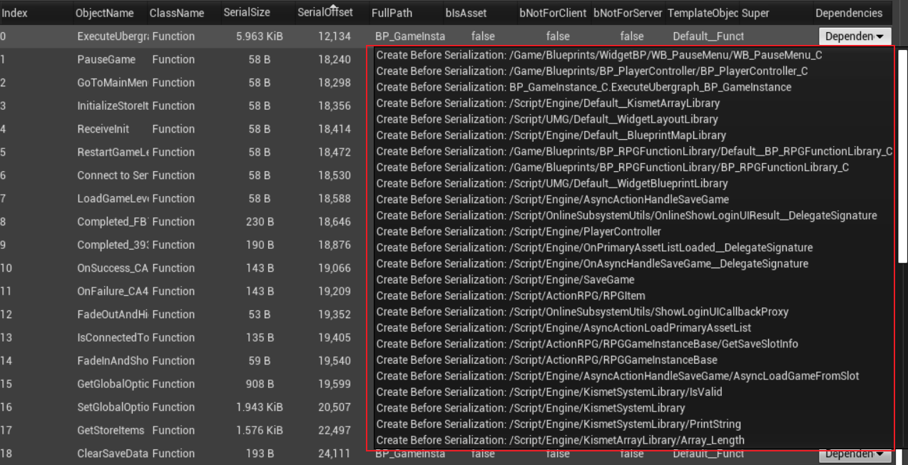

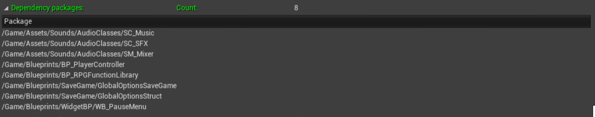

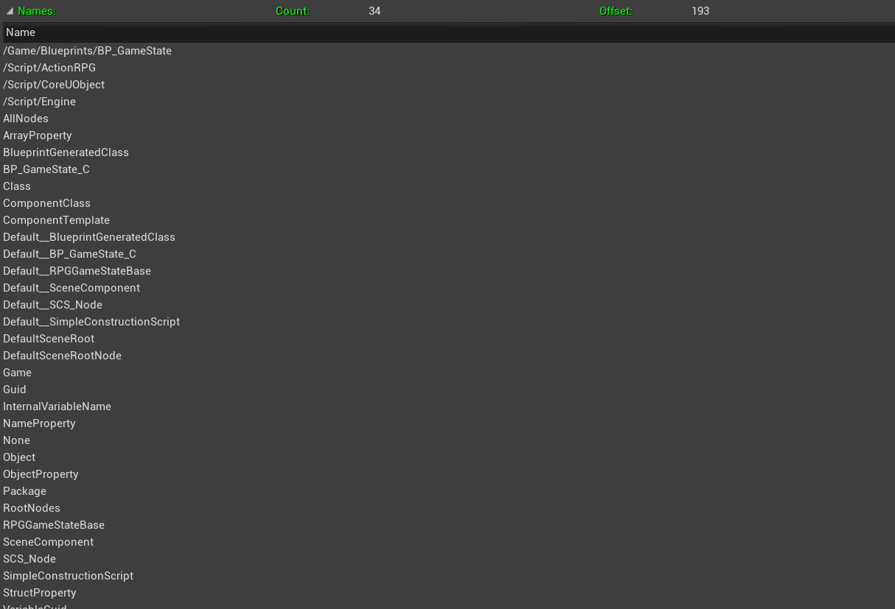

#### Right-click menu ####

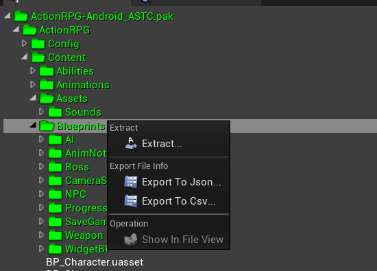

### File list view ###

The file list view displays the file information in the Pak in a table format, and supports sorting by clicking on the column headings

#### Type filtering ####

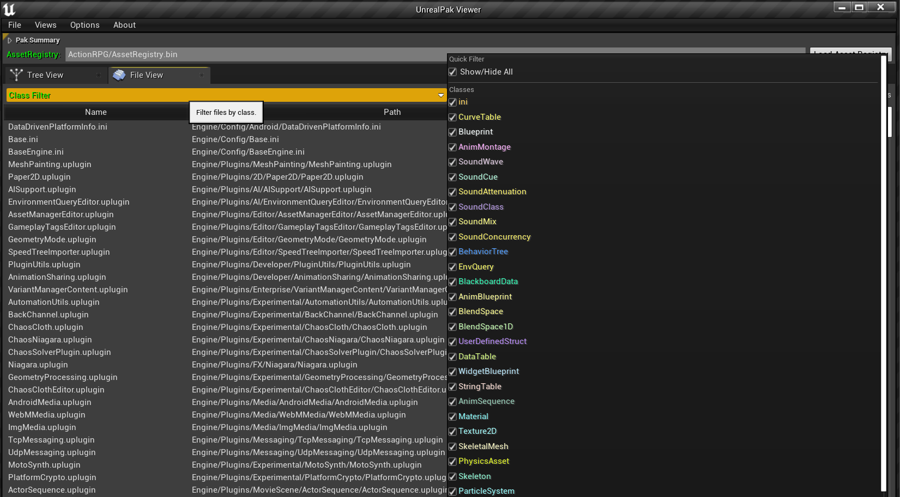

Filter files in the list by type

#### File name filtering ####

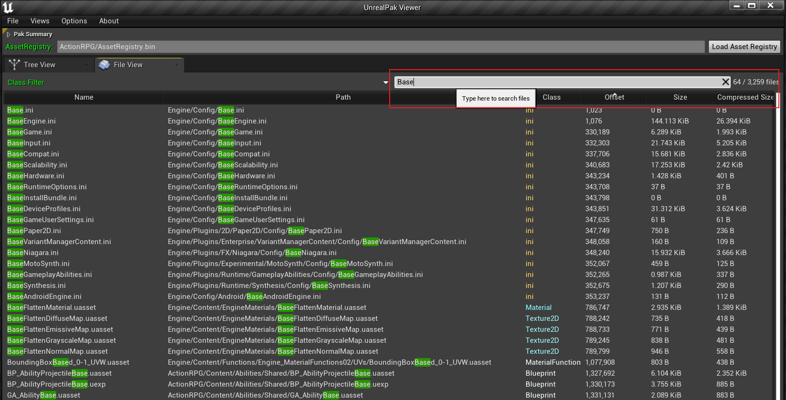

Filter the files in the list by file name

#### Right-click menu ####

## Compiling ##

Clone the code to the *Engine\Source\Programs* directory, open the solution and compile it

* The versions of the engine that have been compiled
  * 4.24
  * 4.25
  * 4.26
  * 4.27
  * 4.28

## TODO ##

* commandline application
* Pak compare visiualize
* resource preview
* resource load heat map
