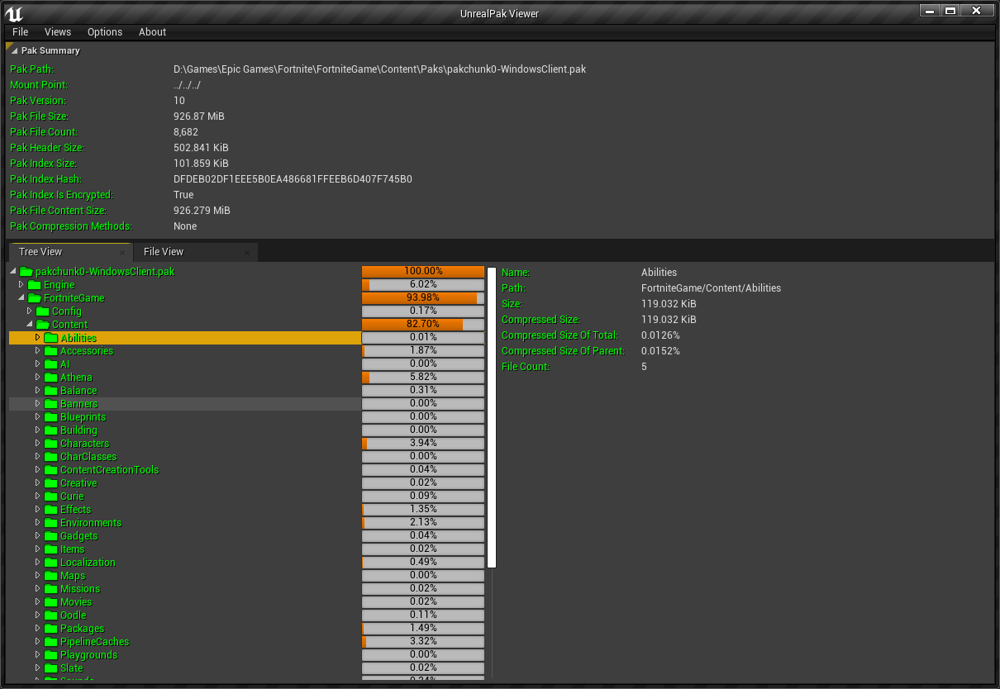

# UnrealPakViewer ##

## 编译 ##

将代码克隆到 *Engine\Source\Programs* 目录下，重新生成解决方案编译即可

* 已编译通过的引擎版本
  * 4.24
  * 4.25
  * 4.26
  * 4.27
  
## 特性 ##

* 查看 pak 文件头信息
* 树形视图查看 pak 文件
  * 文件夹大小占比进度条
* 列表视图查看 pak 文件
  * 支持过滤
  * 支持升降排序
* 多线程解压

## TODO ##

* 命令行程序
* Pak compare visiualize
* resource load heat map
* 文件列表视图里增加文件夹列表(通过选项开关，只显示文件，只显示文件夹，同时显示文件和文件夹)
* Load from json or csv
* 资源预览
